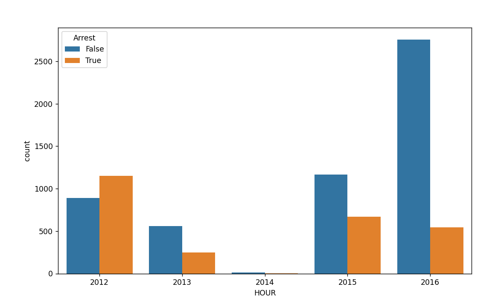
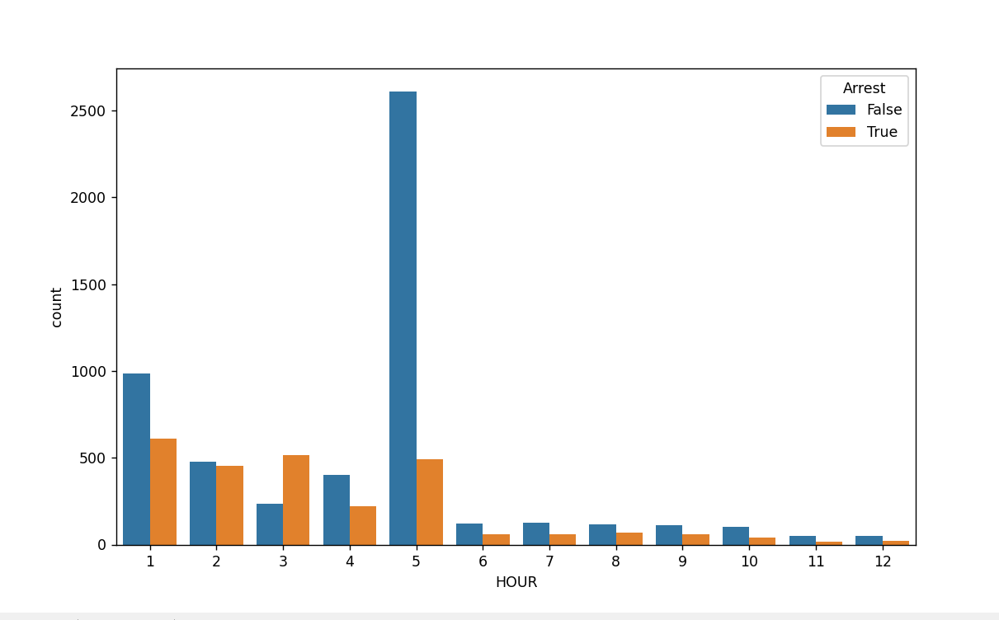
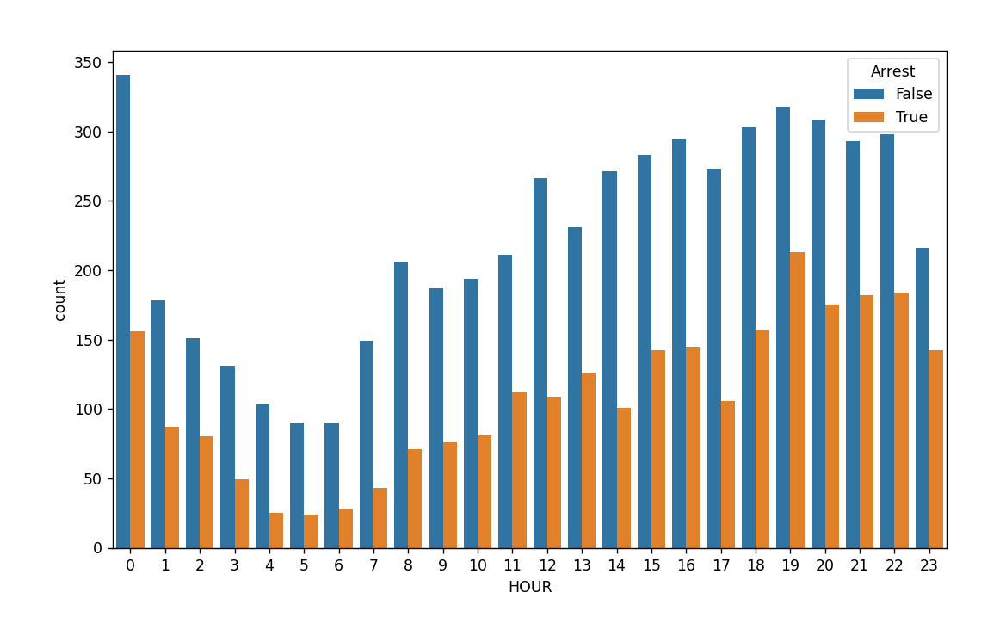
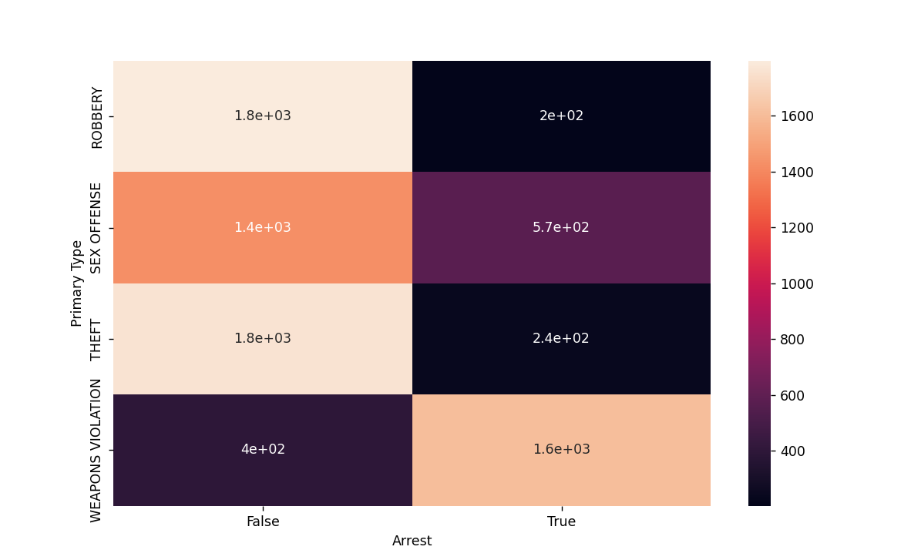

STEPS I TOOK ---

First i want to understand which columns i can drop since this dataset contains appx more than 5m entires its putting a lot of stress on the memory so I am gonna remove columns which are not needed to lessen the stress.

I dropped unnamed and ID even tho they are useful for the police not for me.

Now the DATE i wanted to see if the time of the day also contirubtes to whether an arrest happens or not but date was in STR format so i converted it to datetypeformat. I did not knnow about this before i knew as_Type but not datetime. All corrections are covered in  mistakes.md.

So first I am comparing arrests with year to see significance.
It is significant so we keep it 

Month also plays a huge role 

And so does Hour with the same graph as above 

Now Description and Primary Type overlap so im dropping Description.

Now in the DATA ANALYTICS PART of the program there are different graphs the msot important one is --

Which shows the relationship between the crime type and arrest date

So according to this imagge 1.8e +03 means  1.8 * 10^3

And it shows that for most crimes Non Arrest rate is more than arrest rate hecne higher probability to epxlain.

