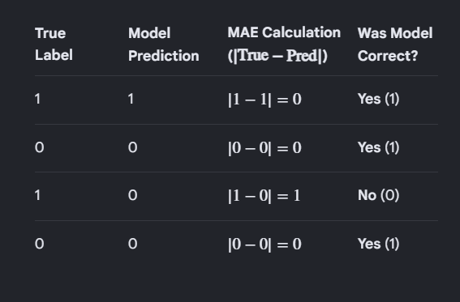

STEPS I TOOK ---

A clear understanding of the dataset is needed--

Column descirption---

Unnamed: 0                int64
ID                        int64
Case Number                 str
Date                        str
Block                       str
IUCR                        str
Primary Type                str
Description                 str
Location Description        str
Arrest                     bool
Domestic                   bool
Beat                      int64
District                  int64
Ward                      int64
Community Area            int64
FBI Code                  int64
X Coordinate              int64
Y Coordinate              int64
Year                      int64
Updated On                  str
Latitude                float64
Longitude               float64
Location                    str
dtype: object

Unnamed: 0: A residual index from a previous save operation (as discussed).

ID: A unique identifier for the specific record in the database.

Case Number: The unique report number assigned by the police department to the incident.

Date: The timestamp of when the incident occurred.

Block: The partially redacted address where the incident took place.

IUCR: The Illinois Uniform Crime Reporting code, which maps to specific types of offenses.

Primary Type: The broad category of the crime (e.g., THEFT, BATTERY).

Description: A sub-category providing more detail about the Primary Type.

Location Description: The type of environment where the incident occurred (e.g., STREET, RESIDENCE).

Arrest: A boolean (True/False) indicating if an arrest was made at the time of the report.

Domestic: A boolean indicating if the incident was domestic-related as defined by the Illinois Domestic Violence Act.

Beat: The smallest police geographic area (patrol area).

District: The police district where the incident occurred.

Ward: The City Council district (Aldermanic ward) where the incident occurred.

Community Area: One of the 77 official neighborhoods/areas of Chicago.

FBI Code: The crime classification used for reporting to the FBI's Uniform Crime Reporting (UCR) program.

X Coordinate / Y Coordinate: The state plane coordinates of the location.

Year: The calendar year the incident occurred.

Updated On: The timestamp of when the record was last modified.

Latitude / Longitude: Geo-coordinates for mapping the incident.

Location: A combined string of the Latitude and Longitude.

First i want to understand which columns i can drop since this dataset contains appx more than 5m entires its putting a lot of stress on the memory so I am gonna remove columns which are not needed to lessen the stress.

I dropped unnamed and ID even tho they are useful for the police not for me.

Now the DATE i wanted to see if the time of the day also contirubtes to whether an arrest happens or not but date was in STR format so i converted it to datetypeformat. I did not knnow about this before i knew as_Type but not datetime. All corrections are covered in  mistakes.md.

So first I am comparing arrests with year to see significance.
It is significant so we keep it 

Month also plays a huge role 

And so does Hour with the same graph as above 

Now Description and Primary Type overlap so im dropping Description.

Now in the DATA ANALYTICS PART of the program there are different graphs the msot important one is --

Which shows the relationship between the crime type and arrest date

So according to this imagge 1.8e +03 means  1.8 * 10^3

And it shows that for most crimes Non Arrest rate is more than arrest rate hecne higher probability to epxlain.

I dropped some more unwanted columns 
Primary Type              int64
Location Description        str
Arrest                     bool
Domestic                   bool
District                  int64
Latitude                float64
Longitude               float64
YEAR                      int32
MONTH                     int32
HOUR                      int32  

At the end i was only left with the above datasets.

Now luckily under Primary Type there were only few unique values so i could map it easily but for the Location Description it had around 8000 unique datasets and plotting it I found out that it was actually recquired for Location Description to be included. Logically also that makes sense  it might be harded to track down a criminal in a busy place that in an empty street.
So Location Description i converted using 

topl = df["Location Description"].value_counts().index
topl=list(topl)
#print(len(topl))
dict1={}
for i in range(len(topl)):
    dict1[topl[i]]=i
#print(dict1)
df["Location Description"]=df["Location Description"].replace(dict1)
df=df.astype({"Location Description":'int64'}) 

Creating a discitonary and mapping each unique value of Location Description to a number  this is important because the models we are using run only on NUMERIC data. 
It cannot mutilpy " House *5" if house is the Location Description.

After i did this now excluding ARREST everything else is what I train my dataset on and ARREST is the target PREDICTION.

so this syntax for that is. 

LIST=[Containing all the training data]
X=df[L]
y=df[Prediction]
X_train,X_test,Y_train,_Y_test=train_test_split(X,y,random_state=0)

How does a computer induce Randomness? 

Randomness IRL is if someone throws a container of beads down, or if someone throws water high up in the air. That is randomness one WILL ALWAYS be different.But how do you program randomness? 
You can't, so what the computer does is PSEUDO RANDOMNESS in my terms. It takes a random number which u give ( random_state=1) and runs it through a complex mathematical equcation like Mersenne Twister ( Not covered in this) and then once the number ocmmes out it will be some other number that to us  seems like a computer selected somthing random.

Okay so ive taken 2 models here 
model=DecisionTreeClassifier()
model2=RandomForrestClassifier()

Now we are gonna be using accuracy_score here and not mean_absolute error because mean_absolute_error works like | Actual - Predicted | but our answers are in 1s or 0s True or False so mean_absolute_error has nothing to actually be mean or absolute abou 1-0 will be 1 and 0-1 will be 1 rather if we use accuracy score it will check the output with a list of pssible correct vlaues and see if we are right then what .
Mean Absolute error works like this ---- 

Now Mean Absopoplute eror will do == MAE CALCUALTION / LENGTH OF MAE CALCUALTION.
Noe accuracy score is calcuate by doing 1-MAE which is also equal to Curr+ent Guess/ Total Score.

Its done. :)

