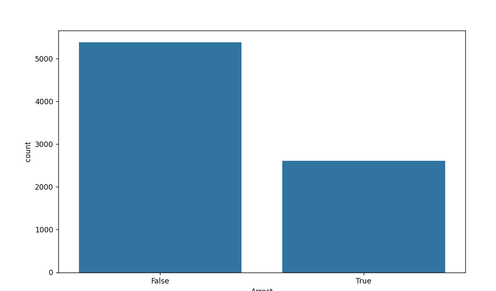
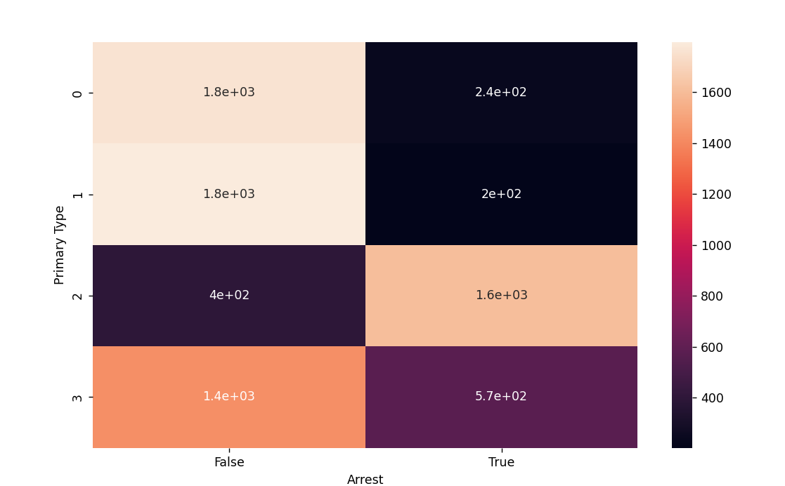
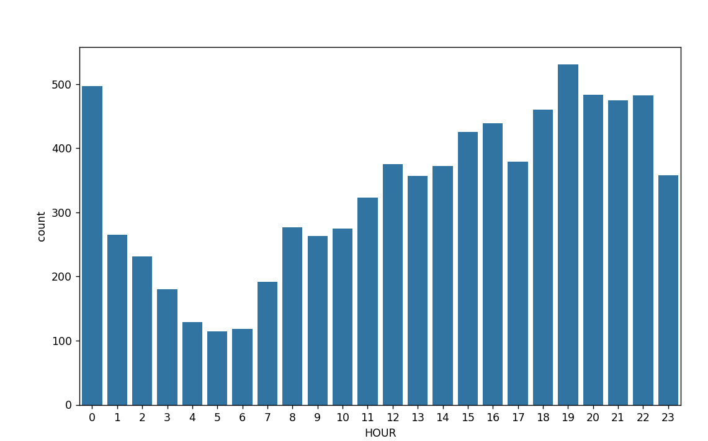
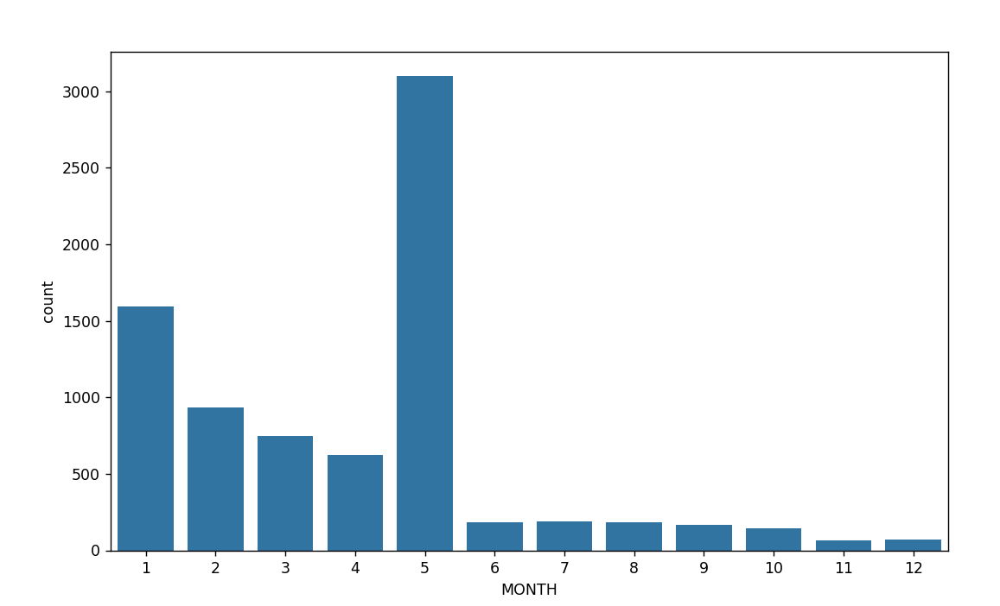

To solve this problem i first need a clear understand of what the dataset is and problem statemnet is--

Problem Statement--
Can we predict whether a crime will result in an arrest — based on location, time, and type?" — Chicago Crime dataset on Kaggle. Massive real dataset from an actual city. Your visualizations will have heatmaps by neighborhood, crime frequency by hour, the works. Sounds like something a police analytics team would actually build

OUTPUT ---

Random Forest Accuracy: 82.9375
Decision Tree Accuracy: 82.0
              precision    recall  f1-score   support

       False       0.84      0.92      0.88      1059
        True       0.81      0.65      0.72       541

    accuracy                           0.83      1600
   macro avg       0.82      0.79      0.80      1600
weighted avg       0.83      0.83      0.82      1600

Arrest
False    5386
True     2614
Name: count, dtype: int64

Most Important Features (Random Forest):
Primary Type            0.420254

Ok so  because our dataset contained more NON ARRESTS than ARRESTS naturally the MODEL was more accurate in predicting NON ARRESTS than ARRESTS that is a DATASET issue.

If we see Flase which means non ARREST that was higher than True. 

Getting an F1 score of 88 and 72 is good. 

This dataset ML model can be improved by using different MLMODELS and synthethically creating data for ARRESTS.If num of ARRESTS was equal to NUM OF NON ARRESTS in the dataset or atleast appx then we would be seeing a much higher accuracy score.

Some other important data to notice is the graphs we plotted about the Chcicago Crime as below -- 

1.Num of Arrests vs Non Arests 

2.Which crime has higher tendency to be caught

3.Relationship between time ot day and arrest

4.Relation between month and arreest

